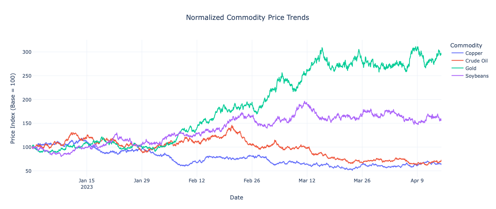
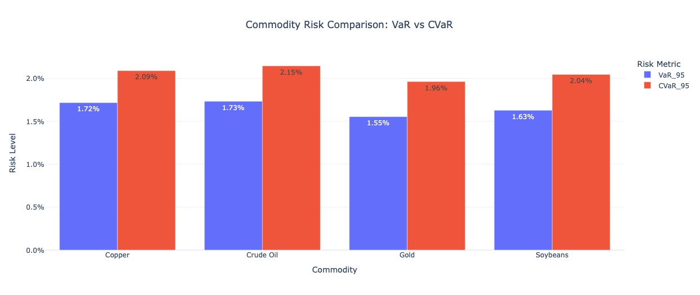
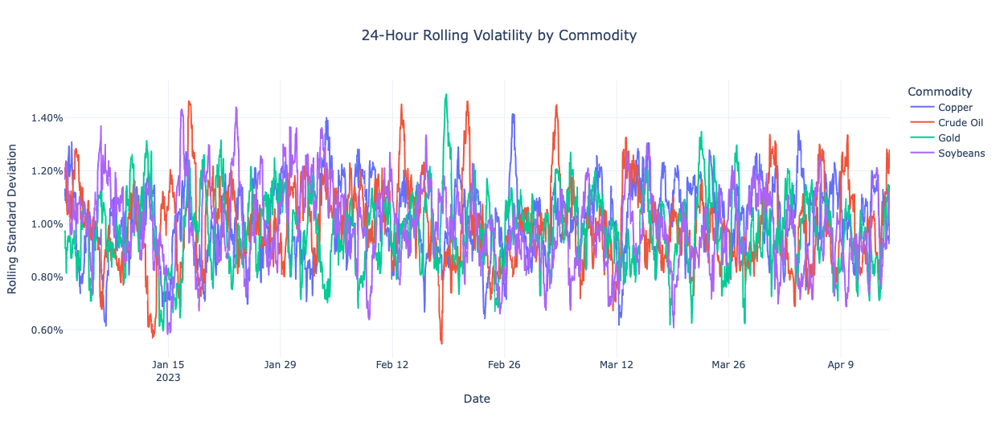

# Commodity Futures Risk Analysis

**Python | Pandas | NumPy | Plotly | Financial Risk Analytics**

## Project Overview

This project demonstrates an end-to-end Python workflow for commodity futures risk analysis, covering data preparation, return calculation, risk measurement, and interactive visualization.

Inspired by my previous academic research involving large-scale financial time-series data, this portfolio project reconstructs key analytical techniques using a reproducible synthetic dataset.

The analysis focuses on four commodities: **Gold, Crude Oil, Copper, and Soybeans**.

> **Data Disclaimer:** All prices are synthetically generated. The findings illustrate analytical methods and do not represent actual commodity market conditions or investment recommendations.

## Project Objectives

- Build a reproducible financial data analysis workflow using Python.
- Perform data quality checks and calculate commodity-specific logarithmic returns.
- Estimate realized volatility, Value at Risk (VaR), and Conditional Value at Risk (CVaR).
- Compare downside risk across four simulated commodity price series.
- Develop interactive visualizations to communicate analytical findings.

## Dataset & Technologies

| Component | Description |
|---|---|
| Data Source | Synthetic commodity price data |
| Commodities | Gold, Crude Oil, Copper, Soybeans |
| Initial Observations | 10,000 |
| Observations After Return Calculation | 9,996 |
| Frequency | Hourly |
| Programming | Python |
| Libraries | Pandas, NumPy, Plotly |
| Environment | Google Colab |

## Analytical Methodology

### 1. Data Preparation

Generated reproducible synthetic price series and performed checks for missing values, duplicate records, and invalid prices.

### 2. Return Calculation

Calculated logarithmic returns independently for each commodity to support time-series risk analysis.

### 3. Risk Measurement

Estimated three risk indicators:

- **Realized Volatility (RV):** Measures accumulated return variability over the full sample.
- **Value at Risk (VaR):** Estimates the downside loss threshold at a 95% confidence level.
- **Conditional Value at Risk (CVaR):** Measures the average loss within the worst 5% of simulated return outcomes.

### 4. Interactive Visualization

Developed three Plotly visualizations to compare price movements, downside risk, and rolling volatility.

## Key Findings

The simulated dataset produced the following results:

| Commodity | Realized Volatility | VaR (95%) | CVaR (95%) |
|---|---:|---:|---:|
| Copper | 0.5114 | 1.72% | 2.09% |
| Crude Oil | 0.5046 | 1.73% | 2.15% |
| Gold | 0.4918 | 1.55% | 1.96% |
| Soybeans | 0.4985 | 1.63% | 2.04% |

**Key Insights:**

1. Crude Oil exhibited the highest simulated tail risk, with a 95% CVaR of approximately 2.15%.
2. Gold recorded the lowest simulated VaR and CVaR.
3. Copper showed the highest full-sample realized volatility measure.
4. CVaR exceeded VaR across all four commodities, reflecting more severe losses in the lower tail of the simulated return distributions.

These findings are specific to the synthetic dataset and should not be generalized to actual financial markets.

## Interactive Visualizations

### 1. Normalized Commodity Price Trends

Compares simulated commodity price trajectories after normalizing each series to a common starting index.

### 2. VaR vs. CVaR Comparison

Compares downside risk thresholds and conditional tail losses across the four commodities.

### 3. Rolling Volatility Analysis

Illustrates changes in short-term return volatility using a 24-hour rolling standard deviation.

## How to Run

1. Open `Commodity_Futures_Risk_Analysis.ipynb` in Google Colab or Jupyter Notebook.
2. Install the required libraries: `numpy`, `pandas`, and `plotly`.
3. Run the analytical cells sequentially to reproduce the dataset, risk metrics, and visualizations.

## Limitations

- The dataset is synthetic and does not reflect actual market trading conditions.
- The simulated prices use simplified assumptions without time-varying volatility regimes.
- VaR and CVaR are calculated from hourly logarithmic returns.
- The full-sample realized volatility measure is not annualized.
- The project is designed to demonstrate data analytics and financial risk measurement skills rather than predict market behavior.
